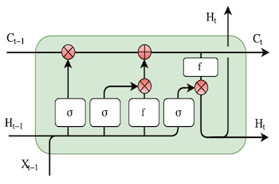

# crypto-price-predictor
Deep learning project by William Guo and David Grossman

<strong>Using Word Semantics and Price Trends to Predict Cryptocurrency Prices</strong>

Will Guo and David Grossman

<strong>Introduction</strong>:

We believe that the cryptocurrency market has the potential to expand significantly from its current state. However, most cryptocurrencies are subject to large fluctuations in price. This, compounded with the constant creation of more and more coins, makes it difficult to determine where exactly to put your money to capitalize on these incredible gains. Thus, our goal is to use previous price trends and sentiment analysis from social media to predict which cryptocurrencies have the potential to grow even further. The model’s goal is to provide investors with a list of cryptocurrencies along with their predicted future trajectories.

<strong>Data/Preprocessing:</strong>

Our model considers (1) price history and (2) sentiment analysis to make its predictions. We therefore used the following two datasets to train our model:

<ol>

<li>The price history data for our model came from coingecko.com. For every cryptocurrency, this data included the cryptocurrency’s day-end price, market cap, and daily volume from the cryptocurrency’s creation to the present. We were lucky that coingecko.com packaged this data in CSV format, which allowed us to access and manipulate the data freely after converting the CSV files to a NumPy array. The only data manipulation we performed before preprocessing was to remove the first couple of days from the dataset because these days had zero volume and were therefore bad data points.  After converting the data to a NumPy array, we normalized the price and volume by changing it to daily percent change of price and volume respectively to not give undue weight to pricier and more popular cryptos such as bitcoin. Additionally, we normalized the market cap by taking the log of it to restrict our data to a more manageable range. Before, the market cap ranged from 0 to 1 trillion dollars, but after taking the log of the market caps, the resultant range ranged from 0 to around 30.

<li>For our sentiment analysis, we scraped tweets directly from Twitter. Using Tweepy, we gathered over 10,000 tweets about each cryptocurrency (containing that crypto’s hashtag, i.e. #BTC) and stored them in CSV files for later access. We tried to take tweets from a large, diverse range of users to reduce bias, but we faced the issue that many of our tweets were not directly related to the crypto in the hashtag. For example, @DArigatoRoboto’s tweet about several popular cryptos (shown in Figure 1) was initially classified under “DOGE” in our dataset, even though it isn’t directly related to DogeCoin. To combat this, we tried to only include tweets that focus on a single cryptocurrency. However, due to the immense size of our dataset, we did not have the resources to completely filter out all irrelevant tweets. After preprocessing our tweets about each cryptocurrency, we passed them into the Natural Language Toolkit (NLTK) for sentiment analysis. To do this, we converted the generated CSVs into a pandas dataframe and added a new row (“processed text”) that contains the tweets that were preprocessed by NLTK. These processed tweets are then used to generate a polarity value, which represents the tweet’s sentiment on a range from -1 (highly negative) to 1 (highly positive). For example, Donald Trump’s tweet about his concerns with Bitcoin (shown in Figure 2) has a polarity of -0.675.
</li>
</ol>

img {
    float: left;
    width:  200px;
    height: 200px;
    object-fit: cover;
}

<strong>Figure 1: </strong>Tweet removed due to lack of focus on specific coin

<strong>Figure 2:</strong> Tweet about Bitcoin with low polarity

<strong>Model Architecture:</strong>

We implemented a Long Short-Term Memory (LSTM) model to make cryptocurrency price predictions. LSTMs are a type of Recurrent Neural Network (RNN), which are excellent for working with time series data like our cryptocurrency price history data.

For a 64-day window of price data about a given crypto, the model processes the data of each day in chronological order. For the tth day, the price change, volume change, and market cap data points are passed into a 1-unit dense layer (with linear activation) to get the ith input (Xt) In addition to the input (Xt-1), The LSTM cell (shown in Figure 3) takes in a hidden state (Ht-1) and cell state (Ct-1). The initial hidden state (H0) is a 128-D trainable vector. The initial cell state (C0) is a 128-D vector that depends on the crypto type being processed. Specifically, it is the output of a dense layer (with linear activation) that takes in several data points from our sentiment analysis as input.

The LSTM is set to return sequences, which means that for inputs [X0, …, X63] of price data for days 0 to 63, it returns its hidden states [H1, …, H64] that correspond to days 1 to 64. The hidden states are then passed through a 256-unit dense layer (with relu activation), a 128-unit dense layer (with relu activation), and finally a 1-unit dense layer (with linear activation) for the final output.

Our model has the option to predict either the percent change in price of a crypto over the next day (REGRESSION mode) or whether the price of a crypto will go up or down over the next day (CLASSIFICATION mode). We achieve this not only by interpreting the output value differently in each mode, but also by tailoring a distinct loss function for each mode.

In REGRESSION mode, the output represents the percent change in price over the next day, scaled by a constant normalization factor. The loss function has the option to either use mean squared error (MSE) or mean absolute error (MAE) between the predicted and true daily percent change. Additionally, the loss function has the option to ignore the error of predictions with the correct sign (whether the price change is positive or negative), as inspired by Zedric Cheung’s article “Customize loss function to make LSTM model more applicable in stock price prediction.”

In CLASSIFICATION mode, the output is greater than 0.5 if the model predicts that tomorrow’s price will be higher, and it is less than 0.5 if the model predicts that tomorrow’s price will be lower. The absolute difference between the output and 0.5 represents the model’s confidence in its answer. Our custom loss function uses the mean absolute error (MAE) between the predicted probability and the true class (1 if price went up, 0 if price went down). As we explain further in the Challenges section, traditional binary cross entropy (BCE) with a sigmoid activation was not suitable for this task, as the extreme randomness of the dataset causes the model to have no confidence in its predictions.

In both model modes, the loss function also has the option to balance its predictions such that it predicts price increases just as often as it predicts price decreases. To accomplish this, it increments the loss by the squared difference between the expected mean (0 for REGRESSION, 0.5 for CLASSIFICATION) and the mean of the predicted outputs. This helps discourage the model from converging too quickly and always making the same prediction.

The model has the following hyperparameter values:

<ul>

<li>Window size = 64

<li>Batch size = 64

<li>Number of LSTM units = 128

<li>Number of Epochs = 5

<li>Learning rate = 0.001 (with decay rate = 0.7 and decay steps = 512) for REGRESSION, or 0.01 (with decay rate = 0.8 and decay steps = 512) for CLASSIFICATION

<li>Optimizer = Adam
</li>
</ul>

<strong>Figure 3: </strong>Diagram of LSTM cell

<strong>Results</strong>

We split our cryptocurrency price dataset into training data and testing data. Our testing data consists of all data from the most recent 100 days, and our training data consists of all data from before then. The model is trained on all of the training data for 5 epochs and then is tested for accuracy on the testing data. Accuracy simply refers to the proportion of the model’s predictions for which it correctly determines whether the price goes up or down. For REGRESSION mode, this is equivalent to whether the predicted percent change is positive or negative. All of the accuracies were relatively close to 50%, but the CLASSIFICATION model with our custom loss function clearly produced the best accuracy (shown in Figure 4).

We also tested each version of the model in a 14-day simulation where it chose to invest in the cryptos that it predicted would perform best. All four versions of the model had positive profit in this simulation, but it is difficult to determine if these results would generalize to the future, especially if the cryptocurrency market goes through a recession as a whole. Again, the CLASSIFICATION model with our custom loss function produced the best 14-day profit (shown in Figure 4).

In general, we found that our model produces more consistently good results for cryptos that are well established, such as Bitcoin and Ethereum. This makes sense, as we have the most data about these coins by far. On the other hand, our model’s predictions about newer cryptos tend to fluctuate much more wildly. The output of our model in CLASSIFICATION mode with the custom loss function (shown in Figure 5) shows how well the model predicted prices for each crypto in our dataset. Overall, the model had a 52.66% accuracy with a P-value of 0.0832. This means that if we instead made random guesses, we would only have a 0.0832 probability of achieving an accuracy at least as high as that of the model. The standard deviation of predictions was also steadily increasing in training, which means that the model had a proper distribution of predictions with relatively high confidence.

<table>
  <tr>
   <td><strong>Model Type</strong>
   </td>
   <td><strong>Loss Function</strong>
   </td>
   <td><strong>Test Accuracy</strong>
   </td>
   <td><strong>14-Day Profit*</strong>
   </td>
  </tr>
  <tr>
   <td>Regression
   </td>
   <td>MSE
   </td>
   <td>49.16%
   </td>
   <td>+2.49%
   </td>
  </tr>
  <tr>
   <td>Regression
   </td>
   <td>MAE
   </td>
   <td>50.80%
   </td>
   <td>+10.11%
   </td>
  </tr>
  <tr>
   <td>Classification
   </td>
   <td>BCE
   </td>
   <td>51.03%
   </td>
   <td>+4.81%
   </td>
  </tr>
  <tr>
   <td>Classification
   </td>
   <td>Custom
   </td>
   <td>52.66%
   </td>
   <td>+15.69%
   </td>
  </tr>
</table>

*Doesn’t account for transaction fees, which could decrease these profit values

<strong>Figure 4: </strong>Results of our model for each model type and corresponding loss function option

<strong>Figure 5: </strong>Output of our model in CLASSIFICATION mode with custom loss function

<strong>Challenges</strong>

We encountered challenges in both preprocessing and the model itself.

For preprocessing, the biggest difficulty that we faced was related to the part of the model that deals with the semantics of tweets. Specifically, we were unsure of the most effective way to preprocess the Twitter data. We experimented with multiple python libraries to interact with the Twitter API, but it was harder than expected to collect an unbiased sample of tweets that are relevant to the cryptocurrencies in our dataset. For example, if a tweet from the creator of Cate Coin talks positively about Cate Coin, we wanted to have some “anti-bias” mechanism that removes this tweet from our sample. In the end, we tried to reduce this type of bias by gathering a large sample of tweets, which through randomization and the Central Limit Theorem, greatly reduces the chance of bias. Another challenge we faced in preprocessing was actually gathering the tweets. Twitter limits the number of tweets that developers can access within a given time frame, which really limited the testing of our code. We kept on hitting the rate limit, which really slowed down the testing of our Tweepy code and caused us to devote more time than necessary on preprocessing.

For the model itself, the biggest difficulty we faced was trying to make the model actually make predictions. Originally, the model was always fluctuating between one of two extremes: either it would always make the same prediction with very high certainty, or it would never have any confidence in its predictions. We realized that this was a result of the immense randomness and noisiness of our dataset. Since cryptos are so volatile, the history of a coin provides little information about its future price. With mean average error (MAE) loss, the model tended to always predict whatever was seen most often in our data. On the other hand, with binary cross entropy (BCE) loss, the model always made predictions with extremely low confidence. We solved this issue to some extent with our custom loss function, which used mean average error (MAE) for classification rather than its standard usage in regression. This encouraged the model to make predictions with some amount of confidence, as unlike with BCE, it wasn’t punished for bad predictions more than it was rewarded for good predictions. In addition to this, we incremented the loss function by the squared difference between the mean of predictions and the expected mean of predictions (i.e., no change in price on average). This encouraged the model to not always make predictions on one end of the continuum. With these two parts of the loss function working against each other in the perfect balance, the model finally learned to make predictions that were symmetrically distributed and sufficiently variable.

<strong>Reflection</strong>

We think our project ultimately turned out pretty well, by meeting our target goals. Our model can train on both pre-existing and current data. While our model did not perform especially well, we also did not expect our model to train well. Due to the inherently mostly random nature of our dataset (cryptocurrency prices and tweets), we didn’t expect our model to have a high accuracy. We were very pleased with the accuracy and overall results that we got from our model (52.66% accuracy and a 15% 2-week profit), especially since the model doesn’t overfit too much.

Over time, our approach towards the final results of our model changed. Initially, we wanted to give the model a list of cryptocurrencies, from which it would automatically start a process to gather data for both these cryptocurrency’s prices and tweets. After starting the project, however, we realized that this was unrealistic. While it wasn’t that difficult to gather and train the data for prices, it was a lot harder to gather live data from Twitter. This was compounded by Twitter’s API’s rate limit. If we didn’t gather and preprocess data beforehand and gathered live data, the process would take hours, just to gather data for a single run. This greatly limited the amount of testing we could do to fine tune the model, which is why we decided to drop this idea and pivot to our current model which does all the preprocessing and gathering first, before training the model. Another change to our approach over time, was to devote a lot of time to make sure the machine was actually making guesses, and not just predicting trivial cases(predicting a rise or fall with very low confidence). As we mentioned above, initially, we set the loss function to more traditional loss functions, before we noticed that our model could get better results using a specialized loss function that more accurately represented the task. If we could do the project over again, the main thing we would do differently would be to use a different metric than tweets as data, for example, google search analytics. As mentioned above, tweets have a lot of issues that we feel like we didn’t address sufficiently, such as the bias the person tweeting may have, as well as some of the tweets being misclassified. Choosing a different data source would solve a lot of these issues while providing similar functionality and results. 

If we had more time, we would probably improve our model by adding more data to the dataset we were using for cryptocurrencies. Coingecko provided easily accessible data, but it was not very comprehensive. Using something like Tweepy, more data could be collected at more frequent intervals directly from the internet, and then fed into the LSTM model for more training. Getting a larger dataset would also help the model discover and learn even more patterns, which would help with training.

We could also potentially add a crypto2vec functionality inspired by word2vec. This would give the model information about which cryptos are most correlated, allowing it to better understand the relationships between different cryptos and their price trends.

We got four main takeaways from this project:

<ol>

<li>One of the biggest takeaways we got from this project was how difficult it is sometimes to know if a model is actually learning or not. Sometimes, especially if the data is noisy, it is hard to differentiate whether results are caused by a learning model or if they are caused by random chance. Because this was an individual project, it had no benchmarks/accuracy thresholds which made it difficult to deduce how good the model actually was. This issue was only briefly mentioned in class, and only after doing an individual project did we get to fully appreciate some of the difficulties deep learning researchers sometimes face when solving problems. 

<li>Another thing we learned more about was the differences between vanilla RNNs, GRUs and LSTMs. While in class we learned about the main differences, this project helped emphasize the performance differences between the three recurrent layers. While not shown in our results, we played around a lot with substituting a RNN, GRU and LSTM layer for the time series prediction. By doing this, we got a deeper grasp on how they are all different. For example, when we tested using larger window sizes, this benefited LSTMs a lot more than GRUs.

<li>Something else we learned about during this project was how to use some new libraries. Extracting and preprocessing data directly from a website exposed us to different packages such as Tweepy, NLTK, and Pandas, which are all useful for any future deep learning projects.

<li>Finally, we learned a lot more about loss functions and how they influence how a model makes its predictions. Specifically, when experimenting with different loss functions for our REGRESSION and CLASSIFICATION model types, we realized how the shape of the loss function impact’s the model’s confidence in its results. With Binary Cross Entropy loss, for example, the model is punished for terrible predictions much more than it is rewarded for perfect predictions, relative to a neutral prediction. This type of loss caused our model to always predict each of the two classes (price will go up tomorrow, price will go down tomorrow) with roughly 50% probability, as deviating from this would risk a significant increase in loss due to the nearly random nature of our dataset.
</li>
</ol>

<strong>References</strong>

    Cheung, Z. (2020, August 5). <em>Customize loss function to make LSTM model more applicable in stock price prediction</em>. towards data science.

    Yeo, H. (2020, November 16). <em>Scrape twitter for sentiment analysis, predict cryptocurrency returns</em>. atoti.

